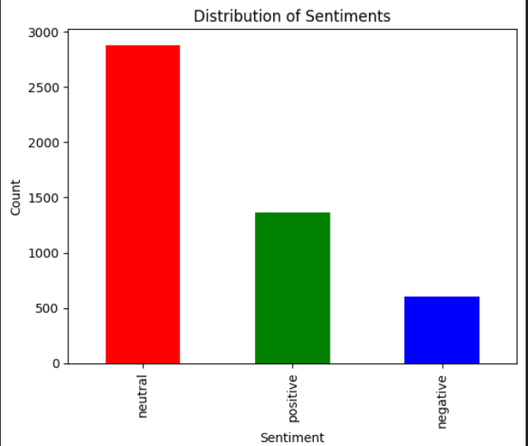
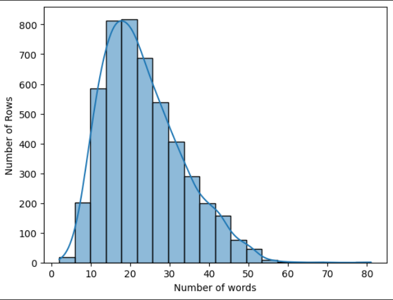
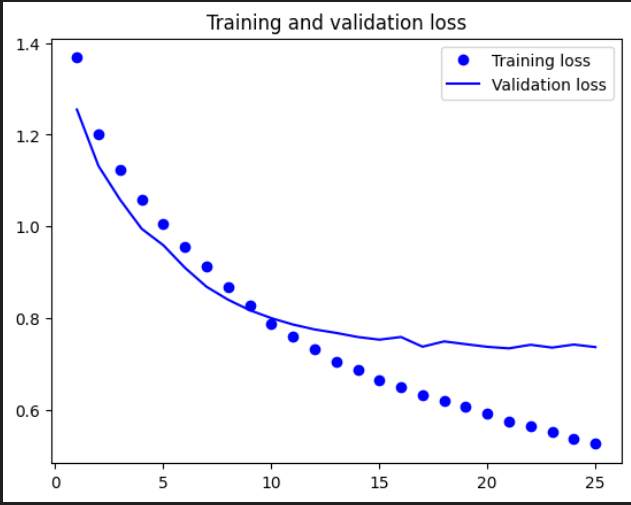
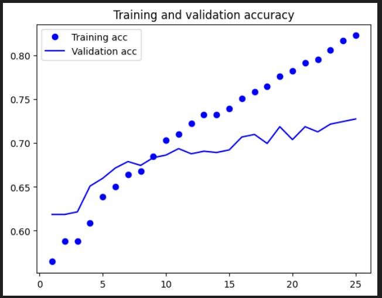
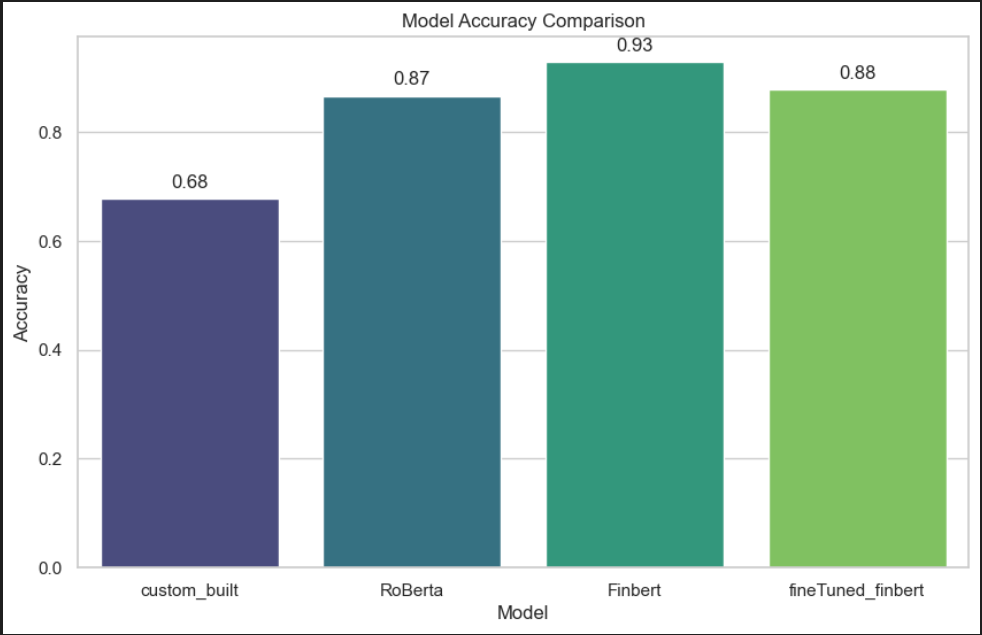

# Sentiment Analysis for Stock Market Prediction

The central aim of this project is to utilize sentiment analysis to understand and predict stock market movements. The project is structured around several key objectives, emphasizing the role of sentiment analysis as a foundational element:

1. **Advanced Sentiment Analysis:**
   Develop a sophisticated sentiment analysis model to accurately interpret and quantify sentiments expressed in financial news, reports, and social media.

2. **Integration with Quantitative Data:**
   Integrate sentiment analysis outputs with traditional quantitative financial data to enrich stock market predictions with qualitative insights.

3. **Real-time Sentiment Analysis:**
   Implement real-time processing capabilities to analyze market sentiments as they evolve, capturing the immediate impact of news and social media on market dynamics.

4. **Risk Management Through Sentiment Indicators:**
   Utilize sentiment analysis as a tool for risk management, identifying potential market shifts and volatility driven by investor sentiment.

5. **Enhanced Stock Market Predictions:**
   Leverage sentiment analysis, along with quantitative data, to significantly improve the accuracy of stock market predictions. Develop predictive models to inform investors about optimal buy or sell times.

## Data Collection

The data collection process involved gathering information from several key sources:
- **Financial Modelling and Prep API (FMP):**
  Real-time market sentiment analysis about specific securities and economic sentiment analysis on news.
- **Kaggle:**
  Data retrieval from the popular website for training a benchmark model and comparative analysis.

## Methodology

### Exploratory Data Analysis (EDA)

- **Number of Labels:** 3 (Positive, Neutral, and Negative).
- **Total Observations:** 4846
- **Data Distribution:** Illustrates the distribution of labels.
- **Sentence Length:** Shows the distribution of sentence lengths.

### Preprocessing

Preprocessing steps for the custom model included encoding labels, text normalization, tokenization, and vectorization.

### Custom Model (RNN)

Setup for the benchmark model included configuring the early stopping strategy and defining the sequential model.

### Evaluating Performance

Evaluation was conducted using both a pretrained model (Distil-Roberta) and a fine-tuned model (Fin Bert) on testing data.

### Comparative Analysis

The performance of different models was summarized, with Fin Bert finetuned outperforming others.

## Performance Optimization

Strategies for maximizing model performance included error analysis, hyperparameter tuning, and model checkpoints with early stopping.

## Model Performance with Rebalanced Dataset

Evaluation metrics with a rebalanced dataset included accuracy, precision, recall, and F1-score for positive, negative, and neutral sentiments.

